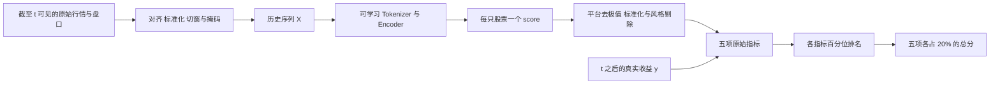
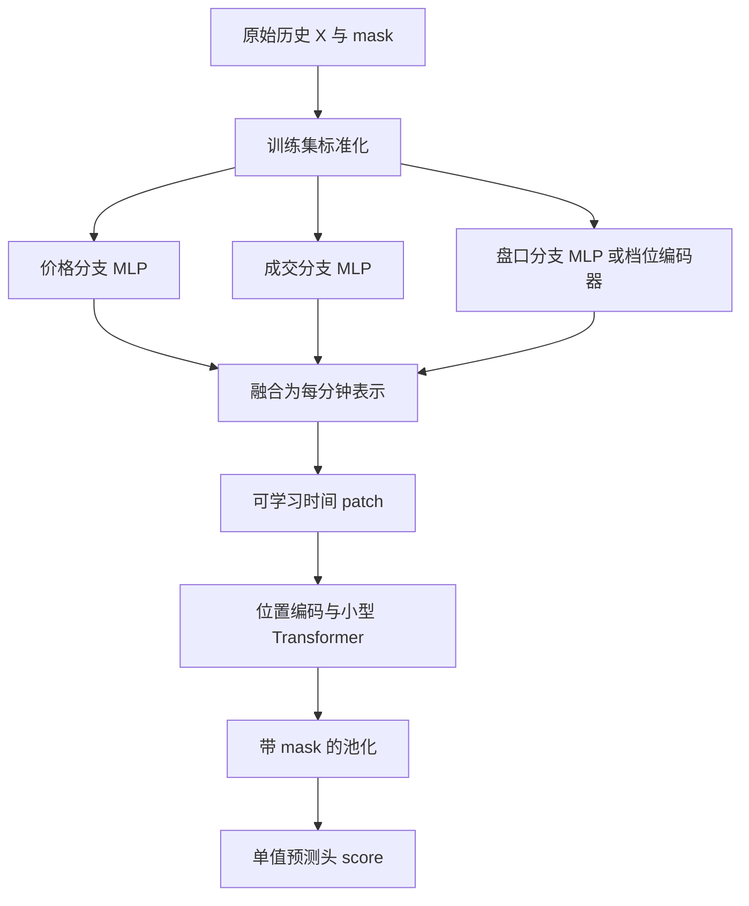

# 进益资本杯 2026 端到端赛道研究方案

围绕 A 股分钟行情与盘口数据，学习未来 30 分钟 VWAP 收益的预测信号。本项目面向具备 AI 基础的团队，记录题目理解、数据表示、候选架构和实验决策。

**研究原则：满足数据、时序和运行约束后，以比赛的五项指标及样本外表现决定模型是否保留。** 参数量、训练损失和重建误差用于诊断与训练；架构修改需要说明预期改善哪项比赛指标，并通过固定时间切分验证。

> 当前状态：已有与真实字段解耦的原型模块，包括训练集标准化、GRU 与 patch Transformer、Huber/排序损失及本地研究指标。真实数据适配、完整训练管线、平台推理 Notebook、模型权重和实测成绩尚未完成。规则依据团队收到的赛事说明整理于 2026 年 10 月 7 日，具体字段和评测细节以比赛平台最终说明为准。

三人团队的责任边界、共同接口与集成安排见 [三人分工与对接方案](docs/team_plan.md)。

## 1. 题目理解

在合法采样时点 $t$，模型读取股票 $i$ 截至该时点已经可见的历史数据，输出一个分数 $s_{i,t}$。分数越大，表示预测该股票未来 30 分钟收益越高。

比赛主要考察同一时点不同股票之间的排序，以及这种排序能力的稳定性和组合表现。模型输出会经过平台统一处理，原始回归误差不能独立决定最终成绩。



历史标签 $y$ 参与训练和评估。公榜、私榜推理仅加载已训练权重，模型不读取预测时点之后的数据，也不在验证集重训。

## 2. 输入与输出

### 2.1 平台接口输入

```python
def main(datasources, start_date, end_date):
    # 通过逻辑名读取当前评测数据，加载权重并生成预测。
    # 返回且仅返回 date、instrument、score 三列。
    ...
```

以上仅展示接口契约，尚未实现。

| 输入 | 含义 | 使用方式 |
| --- | --- | --- |
| `datasources` | 逻辑名到当前评测表名的映射 | 使用 `datasources["bar1m"]` 等获取表名，避免硬编码物理表 |
| `start_date` | 应返回结果的开始时间 | 可以向前读取必要历史，返回区间仍受它限制 |
| `end_date` | 应返回结果的结束时间 | 仅输出评测区间的合法时点 |
| 模型文件 | 权重、配置、字段顺序、预处理参数 | 训练后保存，推理时原样加载 |

可用逻辑源为 `bar1m`、`bar5m`、`bar15m`、`bar30m`，对应分钟 K 线及盘口快照。股票池以中证 1000 历史成分股为基础，可按平台约定使用 `cpt_jyc_2026_instruments` 对齐。

### 2.2 神经网络输入

每个样本是 `(instrument, decision_time)`。以单频率为例：

$$
X_{i,t}\in\mathbb R^{L\times F},\qquad M_{i,t}\in\{0,1\}^{L\times F}.
$$

- $L$：历史记录长度，例如 120 个有效分钟记录，是候选配置。
- $F$：实际允许的原始字段数。
- $M$：缺失掩码，用于区分缺测与真实零值。
- 一个 batch 的形状为 $B\times L\times F$。

已确认的数据类别是 OHLCV 等原始量价序列及盘口快照。盘口是否包含多档报价、挂单量，以及具体列名、复权和单位，仍需读取正式数据字典。价格、成交量、盘口字段分组属于候选编码方案，不代表平台一定提供表中所有字段。

| 原始字段组 | 可能包含的原始值 | 编码用途 |
| --- | --- | --- |
| 价格 | 开盘、最高、最低、收盘 | 保留同一分钟的价格结构 |
| 成交 | 成交量；成交额仅在实际提供时使用 | 学习成交规模及其时序变化 |
| 盘口 | 平台提供的买卖报价、挂单量等 | 保留买卖方向与档位结构 |

### 2.3 预处理边界

赛事允许类型转换、时间与股票对齐、缺失值和异常值处理、标准化、归一化、切窗、批处理及加载优化。不得将依据标签或目标手工设计的技术指标、统计量、价量组合、盘口衍生因子或筛选规则作为模型输入。

第一版采用训练区间拟合的字段级标准化：

$$
z_{\tau,j}=\frac{x_{\tau,j}-\mu_j^{\mathrm{train}}}{\sigma_j^{\mathrm{train}}+\epsilon}.
$$

标准化参数仅用于数值变换，推理复用同一份参数。更复杂的归一化方法须先核对允许范围。

**所有输入记录都必须在决策时点已经可见。** 5、15、30 分钟 K 线只使用已完成周期。必须确认 `date` 表示起点、终点还是快照采集时间。午休、停牌及跨日缺口不能直接当作普通连续分钟；第一版的 patch 不跨交易时段边界，历史不足使用明确的 padding 与 mask。

### 2.4 训练目标与提交输出

教学上的 VWAP 与未来收益可写为：

$$
\mathrm{VWAP}(W)=\frac{\sum_{k\in W}p_kq_k}{\sum_{k\in W}q_k},\qquad
 y_{i,t}\approx\frac{\mathrm{VWAP}_i((t,t+30\mathrm{min}])}{P_{\mathrm{ref}}(i,t)}-1.
$$

第二个式子不是官方标签实现。当前参考价格、窗口边界、复权、停牌处理均需确认。赛事全文同时出现“残差收益率”和“未来 30 分钟 VWAP 收益”，标签是否已残差化也是待确认项。不预测隔夜收益。

模型学习：

$$
s_{i,t}=f_\theta(X_{i,t},M_{i,t}).
$$

推理返回：

| date | instrument | score |
| --- | --- | ---: |
| 2023-01-03 10:30:00 | 000001.SZ | 0.05 |
| 2023-01-03 10:30:00 | 000002.SZ | -0.12 |

表中仅为格式示例。合法 30 分钟采样点由平台定义，每日约 8 个。不得缺失整日或整个时点；每个评估时点缺失率不得高于 40%；不得出现重复键、非法数值或无穷值。

## 3. 比赛评分与模型的连接

模型产生 $s$，平台在同一时点做去极值、标准化与 BARRA 风格剔除，得到处理后信号 $s^*$。以下式子描述处理顺序，具体算法由平台决定：

$$
s^*_{i,t}=\mathrm{Neutralize}(\mathrm{Standardize}(\mathrm{Winsorize}(s_{i,t}))).
$$

最终指标依赖 $s^*$、未来标签 $y$，以及平台根据分数生成的组合权重 $w$。

| 指标 | 依赖的量 | 优化方向 |
| --- | --- | --- |
| IC 均值 | 同一时点的 $s^*$ 和 $y$ | 越高越好 |
| IC_IR | 各时点 IC 序列 | 稳定的正预测能力越强越好 |
| 多空夏普 | 按 $s^*$ 构造的权重与未来收益 | 收益相对波动越高越好 |
| 压力场景稳定性 | 各场景的信号与组合表现 | 弱场景表现和整体稳健性 |
| 换手率 | 相邻时点的组合权重 | 越低越好 |

### 3.1 IC 与 IC_IR

$$
\mathrm{IC}_t=\mathrm{corr}_{i\in S_t}(s^*_{i,t},y_{i,t}),\qquad
\overline{\mathrm{IC}}=\frac1T\sum_t\mathrm{IC}_t.
$$

如果采用 RankIC，则分别将信号与收益转换为名次后相关。无并列名次时：

$$
\mathrm{RankIC}_t=1-\frac{6\sum_i d_i^2}{n(n^2-1)}.
$$

例如四只股票的模型名次为 `[4,3,2,1]`，收益名次为 `[4,2,1,3]`，名次差平方和为 6，则 RankIC 为 $1-36/60=0.40$。有并列值时应使用平均秩等正确方法，不能直接套无并列公式。

未年化的 IC_IR 原理为：

$$
\mathrm{ICIR}=\frac{\overline{\mathrm{IC}}}{\mathrm{sd}(\mathrm{IC}_1,\ldots,\mathrm{IC}_T)}.
$$

赛事文本出现 IC 与 RankIC 两种表述；采用哪种相关系数、是否年化、时点加权及零方差处理，以官方模块为准。

### 3.2 多空组合夏普

$$
R_t^{LS}=\sum_i w_{i,t}y_{i,t},\qquad
\mathrm{Sharpe}\approx\frac{\mathrm{mean}(R_t^{LS}-r_t^f)}{\mathrm{sd}(R_t^{LS}-r_t^f)}\sqrt K.
$$

高分股票的权重为正，低分股票的权重为负。公式是通用原理：平台的分组、权重、成本、收益口径、无风险收益及年化方式尚需确认，不能用自定义组合声称精确复现公榜。

### 3.3 换手与压力场景

常见换手定义为：

$$
\mathrm{Turnover}_t\approx\frac12\sum_i|w_{i,t}-w_{i,t-1}|.
$$

对于场景 $c$，可先查看分场景相关性：

$$
\mathrm{IC}(c)=\mathrm{mean}\{\mathrm{IC}_t:t\in c\}.
$$

**赛事材料没有给出压力场景稳定性的精确聚合公式。** 分场景 IC、夏普、最弱场景与场景间差异是本地诊断量。场景划分及官方聚合不能自行补成已确认规则。

### 3.4 最终总分

五项原始指标分别转为所有有效提交中的 rank 百分位，每项占 20%：

$$
\mathrm{Score}=0.2\left[R_{IC}+R_{ICIR}+R_{SR}+R_{Stress}+R_{Turnover}\right].
$$

其中 $R\in[0,1]$，换手按越低越好排名。五项百分位若为 `[0.80,0.70,0.60,0.50,0.90]`，总分为 0.70。百分位取决于其他有效提交，不能直接由本地训练损失推导。

## 4. 候选架构

### 4.1 主候选：分组编码与时间 patch Transformer



原始字段按语义分组，每组的参数通过训练学习：

$$
e_\tau^g=\mathrm{MLP}_g([z_\tau^g;m_\tau^g]),\qquad
h_\tau=W[e_\tau^{price};e_\tau^{volume};e_\tau^{book}]+b.
$$

把连续 $P$ 条分钟表示编码成一个 patch：

$$
u_k=\mathrm{PatchEncoder}(h_{kP:(k+1)P},m_{kP:(k+1)P}).
$$

PatchEncoder 可以是线性投影或小型时间卷积。它从原始序列学习局部组合，不预先计算技术指标。

| 环节 | 示例形状 | 候选配置 |
| --- | --- | --- |
| 输入 | $B\times120\times F$ | 单频率 1 分钟，实际字段待确认 |
| 分组融合 | $B\times120\times64$ | MLP 与缺失掩码 |
| Patch | $B\times24\times64$ | $P=5$，不跨时段边界 |
| Encoder | $B\times24\times64$ | 2 层 Transformer，4 个头 |
| 池化与预测 | $B\times1$ | 输出一个 score |

以上是工程起点，不是实测最优参数。基线比较使用相同输入的 GRU 或时间卷积。若全部 token 已在预测时点前可见，历史窗口内部双向注意力不会因此泄漏；同时输出较早时点预测时，需要因果掩码或逐时点切窗。

### 4.2 升级路线与评价条件

| 改动 | 预期作用 | 保留条件 |
| --- | --- | --- |
| 线性 patch 换时间卷积 | 保留局部时间顺序 | IC 与稳定性得到可重复改善 |
| 多时间尺度分支 | 同时观察近端状态与长历史 | 弱场景改善且换手、成本可接受 |
| 多频率融合 | 编码已完成的 1/5/15/30 分钟记录 | 可见时间对齐正确，统一评测有增益 |
| 多档盘口编码 | 利用档位与买卖方向结构 | 实际字段足够，平台处理后仍有效 |
| 掩码重建预训练 | 学习原始序列结构 | 相比直接监督训练改善比赛指标 |
| 横截面集合交互 | 学习同一时点股票之间的相对关系 | 集合、缺失与分批方式一致，收益覆盖计算成本 |

横截面交互可使用 Set Transformer 类模块，但应放在独立股票编码基线之后。同一股票的输出可能依赖同批其他股票，训练与推理不能任意改变集合上下文。

## 5. 围绕评分设计训练

### 5.1 从回归和排序开始

已实现 Huber 与同一时点股票对的排序损失；完整训练循环需在真实数据适配后完成。排序目标为：

$$
\mathcal L_{rank}=\mathrm{mean}_{(i,j),t}\log\left(1+\exp[-\mathrm{sign}(y_{i,t}-y_{j,t})(s_{i,t}-s_{j,t})]\right).
$$

原型支持的组合损失为：

$$
\mathcal L=\mathcal L_{Huber}+\alpha\mathcal L_{rank}.
$$

排序 batch 需要保留同一时点的多只股票；采样股票对控制成本，并研究收益差接近零时的标签噪声。不同股票对的训练处理不应变成手工衍生模型输入。

### 5.2 稳定性与换手近似

进一步的研究目标可以写成：

$$
\mathcal L_{proxy}=-\mathrm{mean}_t\rho_t
+\lambda_v\mathrm{Var}_t(\rho_t)
+\lambda_s\mathcal L_{weak}
+\lambda_c\mathcal L_{turn}.
$$

$\rho$ 是可微相关性或排序近似，$\mathcal L_{weak}$ 针对训练期弱场景，$\mathcal L_{turn}$ 针对时间一致性或近似组合换手。它们是候选训练工具，尚未验证；官方评测决定是否采用。

需要防止几个退化解：

- 单独压低相关性方差可能得到稳定但无预测力的输出。
- 单独惩罚原始分数变化，模型可以靠缩小所有分数降低损失，实际排名和换手未必改变。
- 换手约束应使用统一尺度后的信号，或按近似组合权重计算，并同时检查 IC。
- 短 batch 上直接优化夏普和 IC_IR 可能不稳定；先用它们选型，再研究直接训练。
- 压力场景首先用于验证诊断；不额外手工生成场景指标作为网络输入。

最终只有一个 score 输出，五项指标之间存在取舍。每次修改需要记录所有指标，避免只优化其中一项。

### 5.3 从其他领域借鉴

可以借鉴结构和训练目标，在授权训练数据内自行训练。掩码重建损失例如：

$$
\mathcal L_{recon}=\frac1{|\Omega|}\sum_{(\tau,j)\in\Omega}(\hat x_{\tau,j}-x_{\tau,j})^2.
$$

重建只使用训练区间的授权原始序列。重建误差下降不等于预测能力提升，必须与直接监督训练比较。赛事禁止外部预训练权重和未授权数据，因此不把其他领域的权重直接加载为参赛模型。

## 6. 时间验证与实验决策

- 按连续日期划分训练、开发验证和内部留出期，禁止随机拆分重叠分钟窗口。
- 在边界剔除标签窗口跨入下一分区的样本；额外缓冲长度按标签与样本依赖决定。
- 在训练区间拟合预处理，验证与推理保持参数一致。
- 原始输入、股票池选择和多频率对齐都只使用当时可知信息。
- 内部留出期在方案基本固定后使用，避免反复调参耗尽其独立性。
- 删除决策时点之后记录后，同一历史样本的输出应保持一致。

若获得完整 2020—2024 年开发数据，可考虑早期年份训练、中间年份调参、最后一年内部留出的时间方案；具体切分依数据实际覆盖和市场状态决定。

### 初始消融计划

| 实验 | Tokenizer / Encoder | 训练目标 | 状态 |
| --- | --- | --- | --- |
| A0 | 一分钟 token + GRU | Huber | 模块已实现，待真实数据实验 |
| A1 | 分组编码 + GRU | Huber | 模块已实现，待真实数据实验 |
| A2 | 分组编码 + patch Transformer | Huber | 模块已实现，待真实数据实验 |
| A3 | 较优架构 | Huber + 排序 | 损失已实现，待真实数据实验 |
| A4 | 较优架构 | 加稳定性或换手近似 | 计划 |

每次只改变一个主要因素，记录：数据版本、日期切分、字段顺序、标准化、随机种子、五项原始指标、分场景表现、覆盖率和推理耗时。无真实结果时不填公榜成绩。少量固定随机种子的重复实验用于观察增益是否可靠。

## 7. 实施与提交路线

1. 获取实际字段字典、样本记录、合法时点及标签定义。
2. 在短区间构造样本，核对时间边界、mask 与股票池。
3. 跑通单频率基线、时间验证与模型保存。
4. 完成 A0—A3 对比，再决定是否投入 A4 或更复杂结构。
5. 在平台推理环境演练完整区间，检查覆盖率、时间和内存。
6. 提交唯一推理 Notebook，以及训练/推理脚本、依赖、配置、随机种子和完整权重。

依据收到的操作说明：验证集在正式区间前额外提供一年历史供切窗；最终只返回 `start_date` 至 `end_date`。通用总运行时限为 3 小时，端到端 GPU 推理可能依公告放宽。推理环境无法访问外网。

| 截止项 | 提供的赛事说明中的时间 |
| --- | --- |
| 报名 | 2026-10-07 23:59:59 |
| 公榜提交 | 2026-10-29 23:59:59 |
| 私榜候选选择 | 2026-10-30 23:59:59 |

冻结后不能修改代码、权重、参数、依赖或随机种子。最新安排以比赛空间公告为准。

## 8. 待确认事项

- [ ] 原始字段、单位、复权方式与分钟时间戳语义。
- [ ] 官方标签当前参考价、未来窗口边界及是否残差化。
- [ ] 合法采样点、午休/停牌/跨日规则及股票池历史口径。
- [ ] IC / RankIC、IC_IR 年化及有效时点加权方法。
- [ ] 多空分组、权重、交易成本和夏普口径。
- [ ] 换手计算与压力场景聚合公式。
- [ ] BARRA 风格剔除与本地评测模块的对应关系。
- [ ] 输入预处理和编码方案允许范围、最终 CPU/GPU 限制。

## 9. 当前代码与公开边界

已实现的原型结构：

```text
README.md
pyproject.toml
src/jyc_e2e/contracts.py          # 原始字段分组与时间可见性检查
src/jyc_e2e/preprocessing.py      # 仅在训练集拟合的标准化器
src/jyc_e2e/model.py              # 分组编码、GRU、patch Transformer
src/jyc_e2e/losses.py             # Huber 与同截面排序损失
src/jyc_e2e/research_metrics.py   # 本地研究指标，不等同官方评测
examples/forward_demo.py          # 纯模拟数据的前向示例
```

取得正式字段字典后，再实现授权数据读取、合法时点生成、标签对齐、按时间切分、训练入口及平台唯一推理 Notebook。`main(datasources, start_date, end_date)` 的取数和输出契约仍以平台模板为准。

在配置了 PyTorch 的环境中，可安装包并运行仅用于检查张量形状的示例。当前工作环境未安装 PyTorch，因此神经网络前向尚未在此机器验证：

```powershell
python -m pip install -e .
python examples/forward_demo.py
```

示例生成随机数值和随机标签，不包含赛事数据，也不代表预测表现。真实数据进入模型前应由数据适配层调用 `validate_sequences` 与 `validate_availability`。后者要求传入**记录实际完成并可见的时间**；原始表中的时间戳若表示区间起点，需先按平台口径转换。

公开仓库用于设计说明及允许公开的代码。受限行情数据、下载链接、学生身份材料、协议、账号凭证和含敏感内容的日志不进入 Git。模型权重是否允许公开需核对数据协议。仓库代码许可证需由团队确定，引用或改造第三方代码时保留其许可与来源。

已整理的说明文档：

- [比赛规则与参赛流程](01_比赛规则与参赛流程.docx)
- [从输入到评分](02_量化名词与指标解释.docx)
- [模型架构与训练方案](03_模型架构与训练方案.docx)
- [团队分工与开发日程](04_团队分工与开发日程.docx)

若一起上传文档，保持上述相对路径，或移动后同步修改链接。

## 10. 参考论文

以下论文提供架构或研究思路，不证明它们在本赛道有效：

| 文献 | 借鉴内容 | 本项目的适用边界 |
| --- | --- | --- |
| [Nie et al., A Time Series is Worth 64 Words / PatchTST, ICLR 2023](https://arxiv.org/abs/2211.14730) | 时间 patch、通道独立与掩码预训练 | 分组融合版本属于改造；最终输出为单个收益分数 |
| [Liu et al., iTransformer, 2023/2024](https://arxiv.org/abs/2310.06625) | 将变量历史编码成变量 token，学习变量相关性 | 变量 token 与跨股票 token 是不同设计；字段异质性需验证 |
| [Zhang et al., DeepLOB, 2019](https://arxiv.org/abs/1808.03668) | 订单簿结构卷积与时间建模 | 分钟快照与高频订单簿采样不同，不能直接复制输入 |
| [He et al., Masked Autoencoders Are Scalable Vision Learners, 2022](https://arxiv.org/abs/2111.06377) | 遮挡输入并学习重建表示 | 只借鉴方法，在授权训练数据内训练，比赛指标决定是否保留 |
| [Lee et al., Set Transformer, ICML 2019](https://arxiv.org/abs/1810.00825) | 集合注意力与置换一致的集合表示 | 用于后期横截面交互，需解决集合上下文和推理批次一致性 |

## 11. 规则来源

本 README 的赛事规则来自团队收到的 2026 年第二届“进益资本”杯赛事全文与操作说明，包含端到端输入限制、推理接口、统一预处理、五项排名评分与冻结要求。公式中标为近似或通用定义的部分是研究解释，尚需官方模块核对。

比赛空间：[进益资本 BigQuant](https://jinyicapital.bigquant.com/)。
